# Zakładanie portfela MetaMask

## Co to jest MetaMask

MetaMask to portfel który służy do obsługi tokenów opartych o sieć Ethereum. Oprócz obsługi tokenów umożliwia nam łączenie się ze zdecentralizowanymi aplikacjami. Portfel MetaMask dostępny jest jako rozszerzenię do przeglądarek: Chrome, Edge, Brave, firefox lub jako aplikacja mobilna na system iOS, Android.

## Instalacja portfela MetaMask
1. Wchodzimy na oficjalną stronę [MetaMask](https://metamask.io/download/)
2. Klikamy **"Install MetaMask for Edge"**
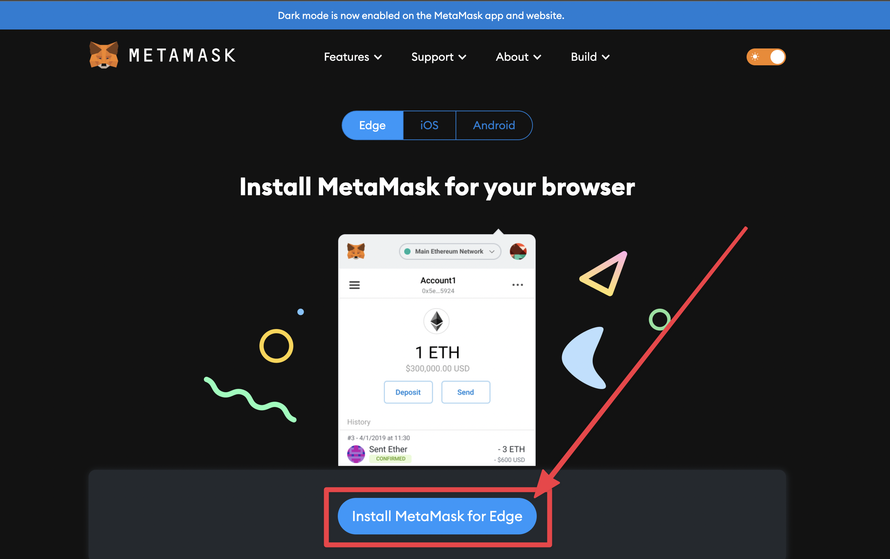
3. Zostaniemy przeniesieni na oficjalny marketplace producenta przeglądarki z której korzystamy. Klikamy **"Get"** w prawym górnym rogu
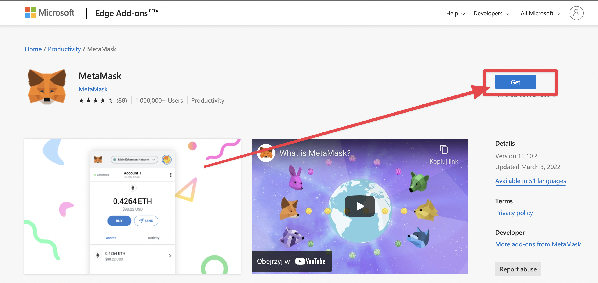
4. Potwierdzamy instalacje klikajac **"Add Extension"**
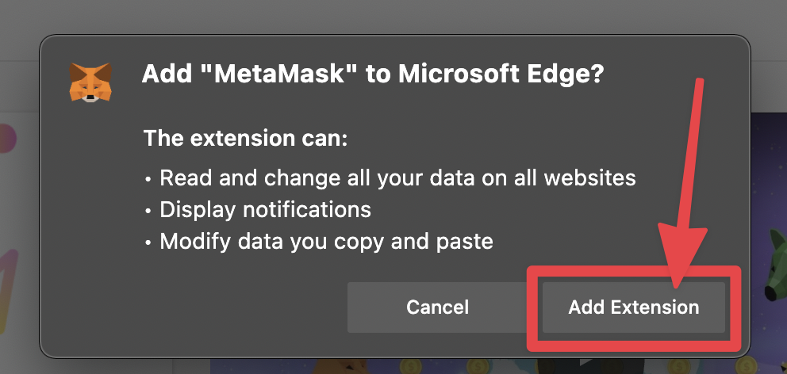

## Konfiguracja portfela MetaMask
1. Po zakończeniu instalacji rozszerzenia zostanie wyświetlona strona konfiguracji. Klikamy **"Rozpocznij"** aby rozpocząć proces konfiguracji
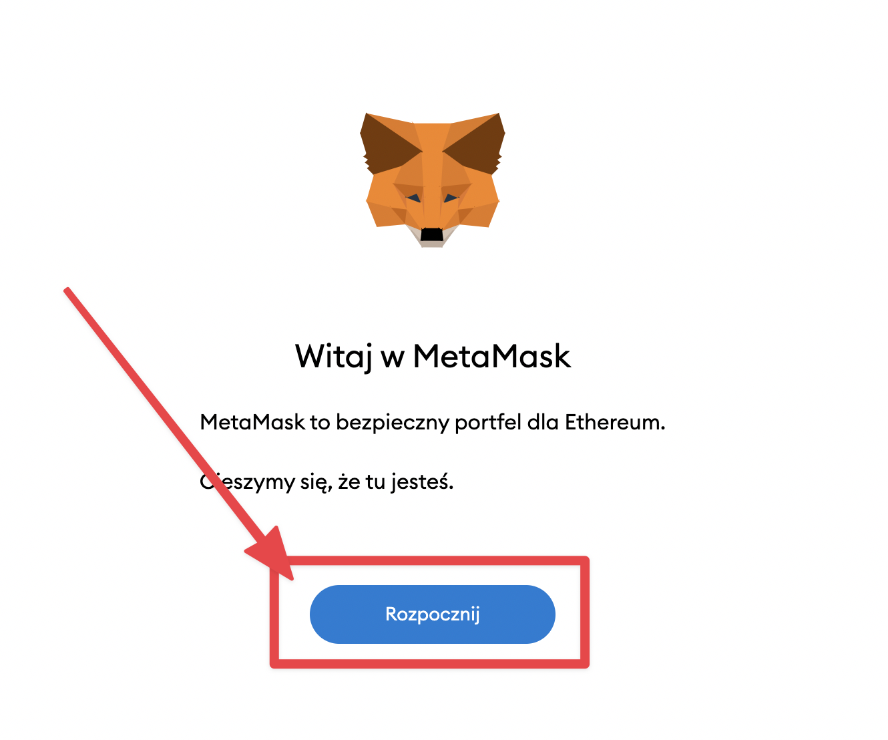
2. W pierwszym kroku konfiguracji wybieramy czy chcemy zaimportować istniejący portfel, czy zakładamy nowy. Wybieramy **"Utwórz portfel"**
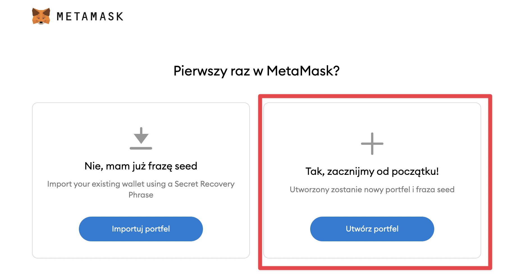
3. W drugim kroku konfiguracji jesteśmy pytani o zgodę na przesyłanie danych telemetrycznych do twórców MetaMask. Ja wybrałem kliknąłem akcję **"No Thanks"**, nie wyraziłem więc zgody na przesyłanie danych
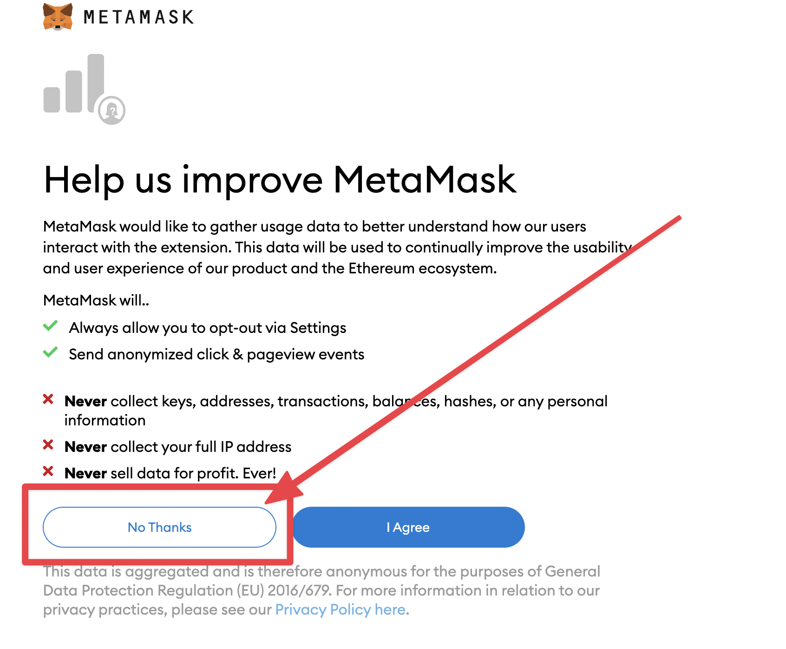
4. W trzecim ktoku konfiguracji ustawiamy hasło do naszego portfela. Hasło musi mieć minimum 8 znaków. Po wpisaniu hasła i potwierdzeniu go w polu poniżej, musimy jeszcze zaakceptować regulamin. Następnie klikamy **"Utwórz"** 
** WAŻNE! Nasze konto nie jest powiązane z adresem email/numerem telefomu. Nie ma więc możliwości przypomnienia czy zmiany hasła po jego utracie. Odzyskanie dostępu do konta możliwe jest jedynie przy użyciu *Secret Recovery Phrase*, ale o tym później.**
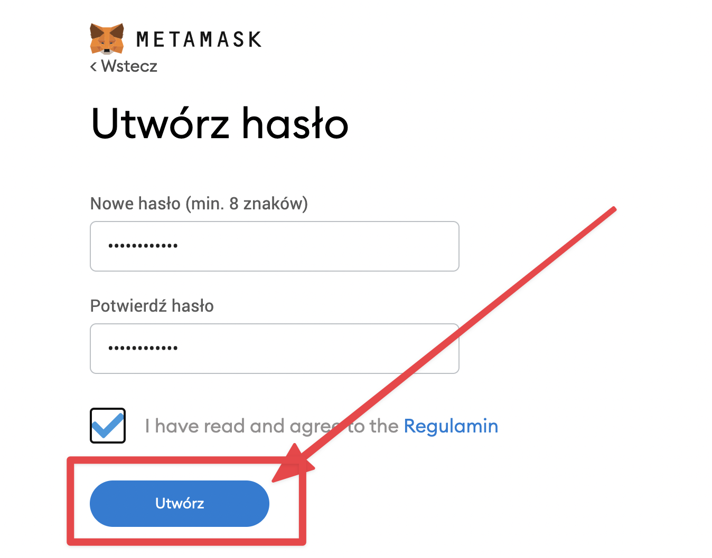
5. W czwartym kroku konfiguracji dowiemy się czym jest *Secret Recovery Phrase* oraz otrzymamy kilka wskazówek dotyczących bezpieczeństwa od twórców MetaMask. Po przeczytaniu klikamy ***"Dalej"***
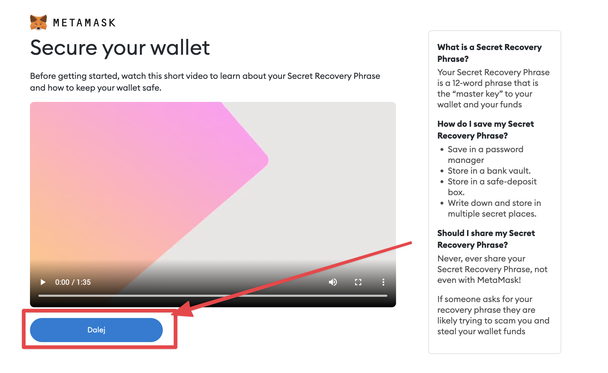
6. W piątym kroku konfiguracji uzyskamy dostęp do *Secret Recovery Phrase* dla naszego konta. **WAŻNE! Nigdy nie udostępniaj nikomu swojego hasła odzyskiwania!**
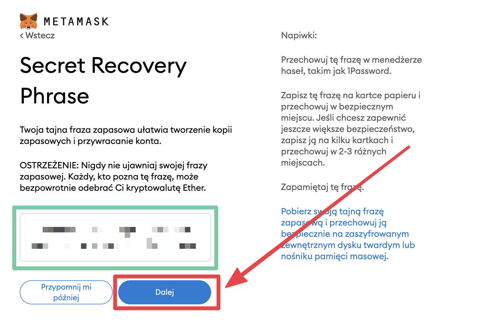
7. W szóstym kroku musimy potwierdzić hasło odzyskiwania które otrzymaliśmy w krimg/oku poprzednim. W celu potwierdzenia klikamy kolejno w słowa widoczne na ekranie aż do uzyskania całej frazy. Po poprawnym wprowadzeniu klikamy ***Potwierdź***
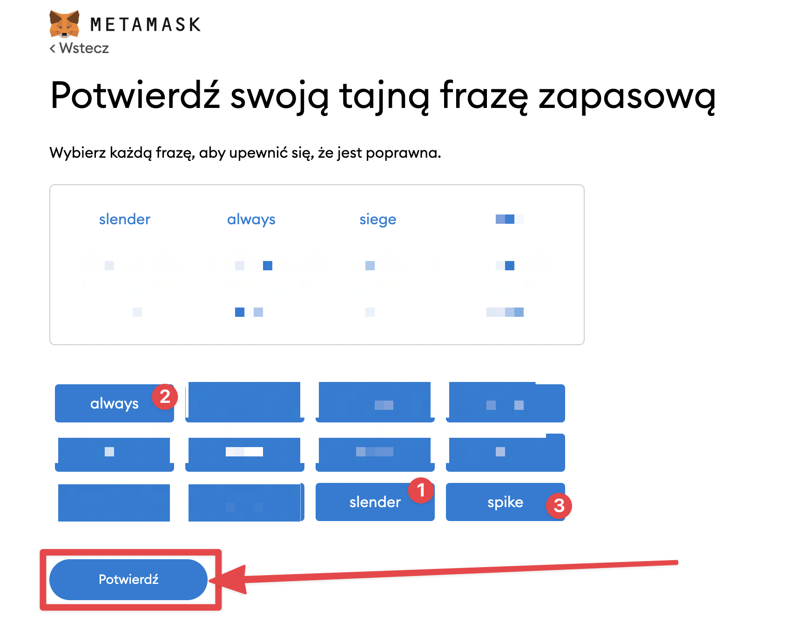
8. W ostatnim kroku otrzymamy potwierdzenie założenia portfela MetaMask. Klikamy **Wszystko gotowe**
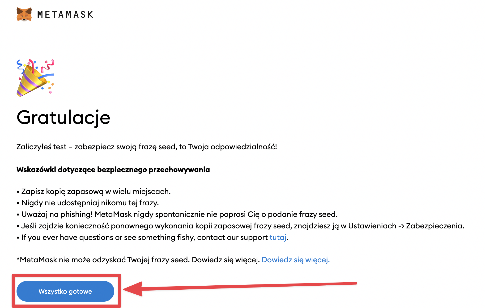
9. Gotowe! Nasz portfel MetaMask jest już skonfigurowany i gotowy do użycia